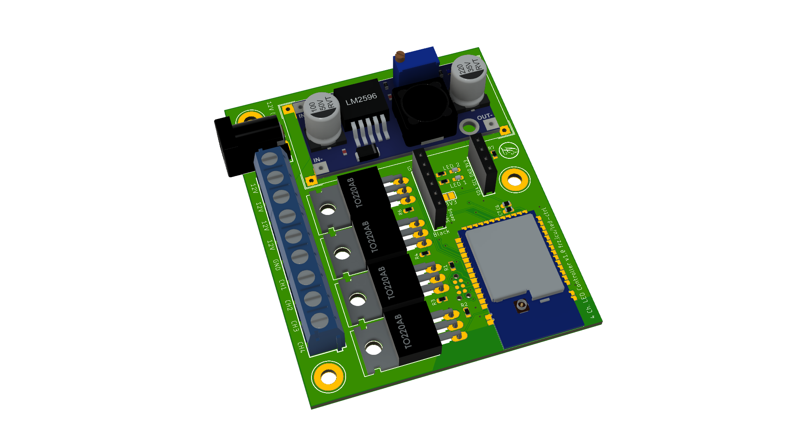

```!!! Note: RX and TX are interchanged. Has not been fixed yet in the files. !!!```


# Simplest LED Controller



Very simple LED controller with an NRF52 as MCU. Controlled via Home Assistant and MySensors using ESB protocol. Basically, it's just a PCB with some MOSFETs, a few resistors and caps as well as a screw terminal.

Only very few advanced components have been used for this project (actually it's just the nRF that is somewhat advanced).

## Partlist

|Component           |Value                    | Package |
|--------------------|-------------------------|---------|
|C6                  | 10µF Cap                |0603     |
|C7                  | 0.1µF Cap               |0603     |
|D2, D3              | LED                     |0603     |
|IC3                 | E73_2G4M04S             |         |
|J1                  | Socket Header 6P        |         |
|J2                  | Socket Header 4P        |         |
|J4                  | Screw Terminal (3*3P)   |         |
|Q1-Q4               | IRLZ44N                 ||TO-220  |
|R1-R4, R6           | 10K Resistor            |0603     |
|R5, R17             | 1K Resistor             |0603     |
|R7, R8              | I2C Pullups             |0603     |
|U$1                 | LM2596-MODULE           |         |
