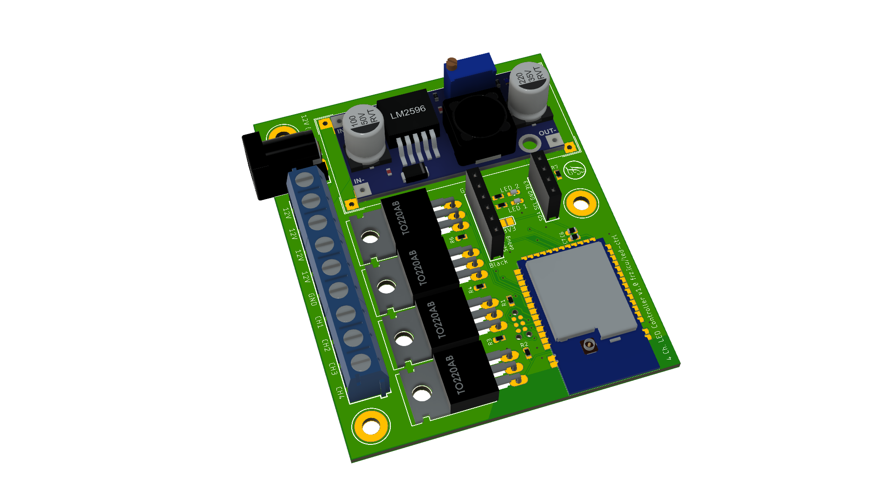

# Simplest LED Controller



# Abstract
As home automation becomes more and more popular, more and more smart home enabled devices replace old-fashioned switch-controlled devices. However, different systems have several advantages and disadvantages that makes it hard to choose the perfect system. A solution to that is to make your own smart home devices.  
This project’s goal was to minimise both the complexity and the cost of such a self-built device. 

# Features
The “Simplest-LED-Controller” features 3 usable PWM-controlled channels (and one on-off channel) and is being programmed using the Arduino framework. It consists of very basic components with the exception of the nRF52-module. The latter is the MCU of the project and it communicates via ESB-protocol with a gateway. This module consumes very little energy while idling, making it a much better solution than WiFi-based ones.

# Hardware
The LEDs are controlled using 4 Mosfets (IRLZ44N) that are broadly available. The power for the MCU is supplied by a LM2596-Module that can be purchased very cheaply. For basic functionality, only the nRF-module, the buck converter, the Mosfets, the screw terminals and a few 0603 10k resistors are necessary.  
```Note: always adjust the step down converter's voltage to 3.3V before assembling!```  
The board also features an interface for a FTDI (or equivalent) and a breakout of the I2C pins, so a sensor could be connected to the MCU in addition.  
The board is being programmed through a Tag-Connect interface using a J-Link or similar.

# Software
As for the software, the MySensors library is used to allow an easy implementation of the ESB-protocol of the nRF52.


## Partlist

|Component           |Value                    | Package |
|--------------------|-------------------------|---------|
|C6                  | 10µF Cap                |0603     |
|C7                  | 0.1µF Cap               |0603     |
|D2, D3              | LED                     |0603     |
|IC3                 | E73_2G4M04S             |         |
|J1                  | Socket Header 6P        |         |
|J2                  | Socket Header 4P        |         |
|J4                  | Screw Terminal (3*3P)   |         |
|Q1-Q4               | IRLZ44N                 ||TO-220  |
|R1-R4, R6           | 10K Resistor            |0603     |
|R5, R17             | 1K Resistor             |0603     |
|R7, R8              | I2C Pullups             |0603     |
|U$1                 | LM2596-MODULE           |         |
